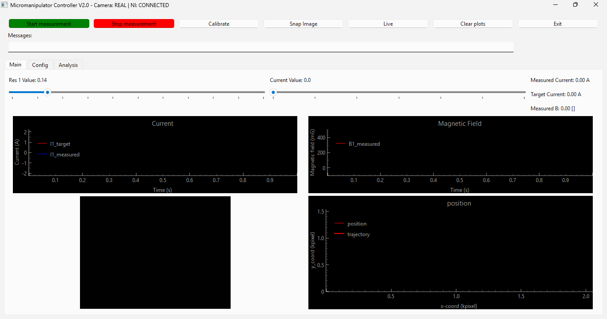
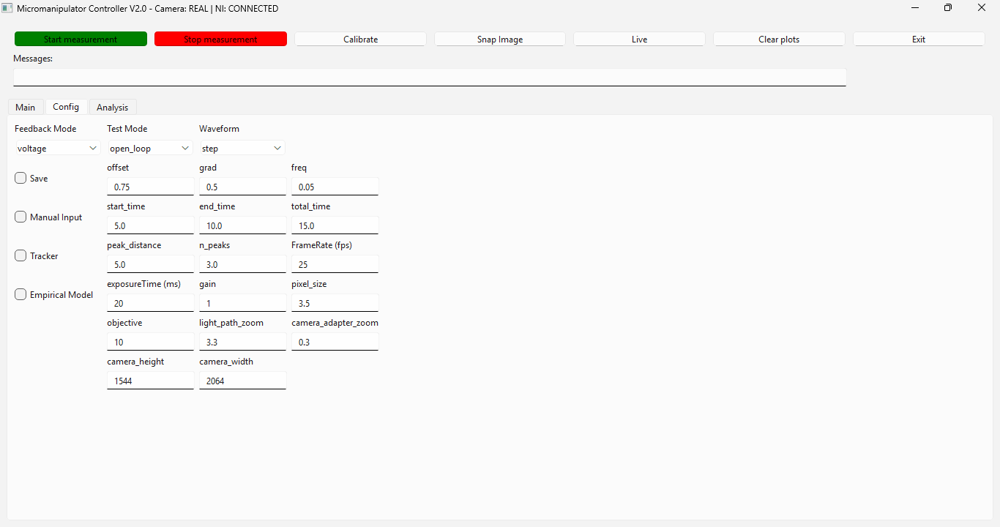

# OneCoilMicroRheometer

One coil microrheometer software and analysis related to research publication: DOI YYY.

***Data avaibility**: Data can be dowloaded from YYYY . This "results" file needs to be placed in "./Analysis/" to draw the images and load the models correctly. Hardware schematics available in https://github.com/ArttuD/microrheology.git

**Comsol**: Comsol simualtion used to numerically solve magnetic fields related to the setup

**Analysis**: Notebooks demonstrating analysis performed in the paper including figure generating.

**Software**: Microrheology test setup controller with GUI, hardware, and real-time data acquisition.

### **Hardware Integration**
- National Instruments DAQmx: AI/AO also integrates DO for relay control
- Basler camera support with Pylon SDK
- Hardware detection and replace with emulators if missing

### **Logging and Error handling**
- Tried to include logging, and error handling at professional level, but ran out of motivation in the middle.

## Installation and Running

### Prerequisites

- Python >3.8
- National Instruments DAQmx
- Basler Pylon SDK
- Tested with Windows 11

```bash
# Clone the repository
git clone https://github.com/ArttuD/OneCoilMicroRheometer.git
cd OneCoilMicroRheometer

# Install dependencies
pip install -r requirements.txt


# Run the application
python software/main.py
```



1. **Calibration**
   - Click "Calibrate" to calibrate hall sensor
   - Monitor progress in the status area

2. **Measurement**
   - Set measurement duration and parameters
   - Click "Start Measurement" to begin
   - Position control requires snapping image and selecting the target bead



3. **Configure Parameters**
   - Open the "Config" tab
   - Adjust measurement parameters
   - Select hardware configuration
   - Manual tuning to fine tune resistance value

4. **Measurement Modes**
   - Open-loop: Without feedback 
   - Position: FEM feedback
   - Position and empirical enabled: KRR feedback


